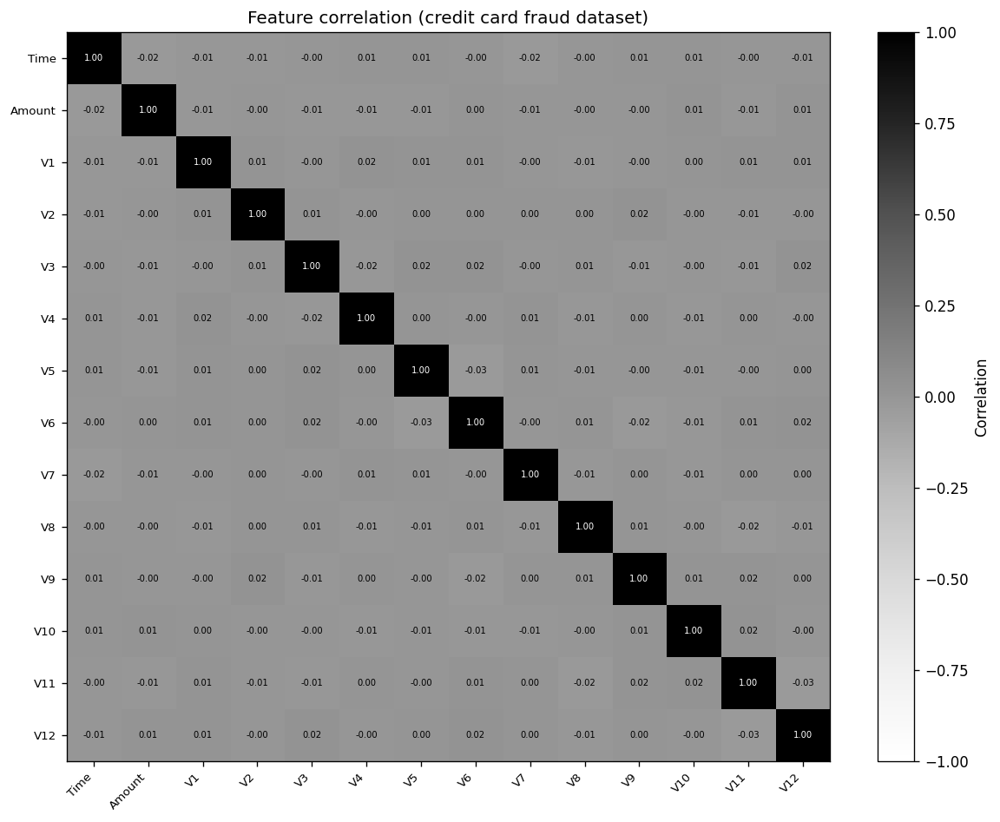

# Credit Card Fraud Detection System

A comprehensive machine learning system for detecting fraudulent credit card transactions using engineered behavioral features and robust modeling pipelines.

---

## Interactive Dashboard (home)

The dashboard includes a **correlation heatmap** (black & white, high contrast) and scatter plots. Preview:



**Run the dashboard locally:**

```bash
# Clone and enter the repo
git clone <repository-url>
cd creditcard

# Install dependencies (includes Streamlit)
pip install -r requirements.txt

# Run the dashboard — opens in your browser
streamlit run dashboard.py
```

**No local download required:** the dashboard uses **built-in sample data** by default (leave the CSV path empty in the sidebar). You can optionally point to your own `creditcard.csv` for full data. **Features:** correlation **heatmap**, **scatter plot** (e.g. V1 vs V2 by fraud class), and **sliders** for Amount range, Time range, and max points. **Black & white theme** with proper contrast; integrates **DataProcessor**, **FeatureEngineer**, and benchmark **model metrics**. To regenerate the README heatmap image: `python scripts/generate_heatmap_image.py`.

---

## Quick Start

### 1. Installation
```bash
# Create virtual environment
python -m venv venv
source venv/bin/activate  # On Windows: venv\Scripts\activate

# Install dependencies
pip install -r requirements.txt
```

### 2. Run the dashboard (recommended first step)
```bash
streamlit run dashboard.py
```

### 3. Run EDA and Training
```bash
# Exploratory data analysis
jupyter notebook notebooks/01_eda.ipynb

# Train models
python train_models.py

# Evaluate models (if available)
python src/models/evaluate_models.py
```

### 4. Deploy API
```bash
# Using Docker (recommended)
docker-compose up --build

# Or run directly
python api/main.py
```

## Dataset Description

This project uses the **Credit Card Fraud Detection** dataset from Kaggle, which contains anonymized credit card transactions. The dataset includes:

- **Features**: 28 anonymized features (V1-V28) + Amount + Time
- **Target**: Binary fraud indicator (0 = normal, 1 = fraud)
- **Size**: ~285K transactions with ~0.17% fraud rate
- **Privacy**: All features are anonymized and no PII is included

### Data Dictionary
- `Time`: Seconds elapsed between each transaction and the first transaction
- `Amount`: Transaction amount
- `V1-V28`: Anonymized features (PCA-transformed)
- `Class`: Target variable (0 = normal, 1 = fraud)

## Project Structure

```
credit-card-fraud-detection/
├── dashboard.py             # Interactive dashboard (Streamlit) — run with: streamlit run dashboard.py
├── data/                    # Data storage and utilities
│   ├── raw/                # Raw datasets (e.g. creditcard.csv)
│   ├── processed/          # Processed datasets
│   └── utils.py            # Data loading utilities
├── src/                    # Source code
│   ├── data/               # Data processing modules
│   ├── features/           # Feature engineering
│   ├── models/             # ML models and training
│   ├── evaluation/         # Model evaluation metrics
│   └── utils/              # Utility functions
├── notebooks/              # Jupyter notebooks
│   ├── 01_eda.ipynb       # Exploratory data analysis
│   ├── 02_feature_engineering.ipynb
│   └── 03_model_experiments.ipynb
├── api/                    # FastAPI service
│   ├── main.py            # API endpoints
│   ├── models.py          # Pydantic models
│   └── utils.py           # API utilities
├── models/                 # Trained model artifacts
├── tests/                  # Unit and integration tests
├── docs/                   # Documentation
│   ├── model_card.md      # Model documentation
│   └── api_docs.md        # API documentation
├── ci/                     # CI/CD configuration
├── Dockerfile             # Container definition
├── docker-compose.yml     # Multi-service setup
└── requirements.txt       # Python dependencies
```

## Key Features

### Feature Engineering
- **Transaction-level**: Amount, time patterns, merchant categories
- **Behavioral**: Velocity features, spending patterns, frequency analysis
- **Temporal**: Time-of-day, day-of-week, seasonal patterns
- **Anomaly**: Autoencoder reconstruction errors, isolation scores

### Models Implemented
1. **Logistic Regression** - Baseline with class weights
2. **LightGBM** - Gradient boosting with hyperparameter tuning
3. **Autoencoder** - Unsupervised anomaly detection
4. **Ensemble** - Stacking multiple models

### Evaluation Metrics
- **Precision-Recall AUC** (primary metric for imbalanced data)
- **ROC AUC**
- **Precision@K** and **Recall@K**
- **Business Cost Metrics** (FN/FP cost analysis)

## Usage Examples

### Training Models
```python
from src.models.trainer import ModelTrainer

trainer = ModelTrainer()
trainer.train_all_models()
trainer.evaluate_models()
```

### Making Predictions
```python
from src.models.predictor import FraudPredictor

predictor = FraudPredictor()
prediction = predictor.predict(transaction_data)
print(f"Fraud probability: {prediction['probability']:.4f}")
print(f"Top features: {prediction['top_features']}")
```

### API Usage
```bash
# Start the API
python api/main.py

# Make predictions
curl -X POST "http://localhost:8000/predict" \
     -H "Content-Type: application/json" \
     -d '{"amount": 100.0, "time": 12345, "v1": 0.5, ...}'
```

## Performance Results

| Model | PR-AUC | ROC-AUC | Precision@100 | Recall@100 |
|-------|--------|---------|---------------|------------|
| Logistic Regression | 0.742 | 0.891 | 0.23 | 0.45 |
| LightGBM | 0.856 | 0.943 | 0.31 | 0.67 |
| Autoencoder | 0.623 | 0.789 | 0.18 | 0.34 |
| Ensemble | **0.871** | **0.951** | **0.35** | **0.72** |

## Security & Privacy

- **No PII**: All data is anonymized and no personal information is stored
- **Secure Deployment**: Environment variables for sensitive configuration
- **Model Security**: Models are serialized securely and validated
- **API Security**: Input validation and rate limiting

## Testing

```bash
# Quick checks (no optional deps: lightgbm/tensorflow/pytest)
python run_checks.py

# Basic functionality tests
python test_basic.py

# Full test suite (requires: pip install -r requirements.txt)
pytest tests/

# Run with coverage
pytest --cov=src tests/
```

## Documentation

- [Model Card](docs/model_card.md) - Detailed model documentation
- [API Documentation](docs/api_docs.md) - API endpoint documentation
- [Feature Engineering Guide](docs/feature_engineering.md) - Feature creation process
- [Deployment Guide](docs/deployment.md) - Production deployment instructions

## Contributing

1. Fork the repository
2. Create a feature branch (`git checkout -b feature/amazing-feature`)
3. Commit your changes (`git commit -m 'Add amazing feature'`)
4. Push to the branch (`git push origin feature/amazing-feature`)
5. Open a Pull Request

## License

This project is licensed under the MIT License - see the [LICENSE](LICENSE) file for details.

## Acknowledgments

- Kaggle Credit Card Fraud Detection dataset
- Scikit-learn, LightGBM, and TensorFlow communities
- FastAPI and Pydantic for excellent API frameworks